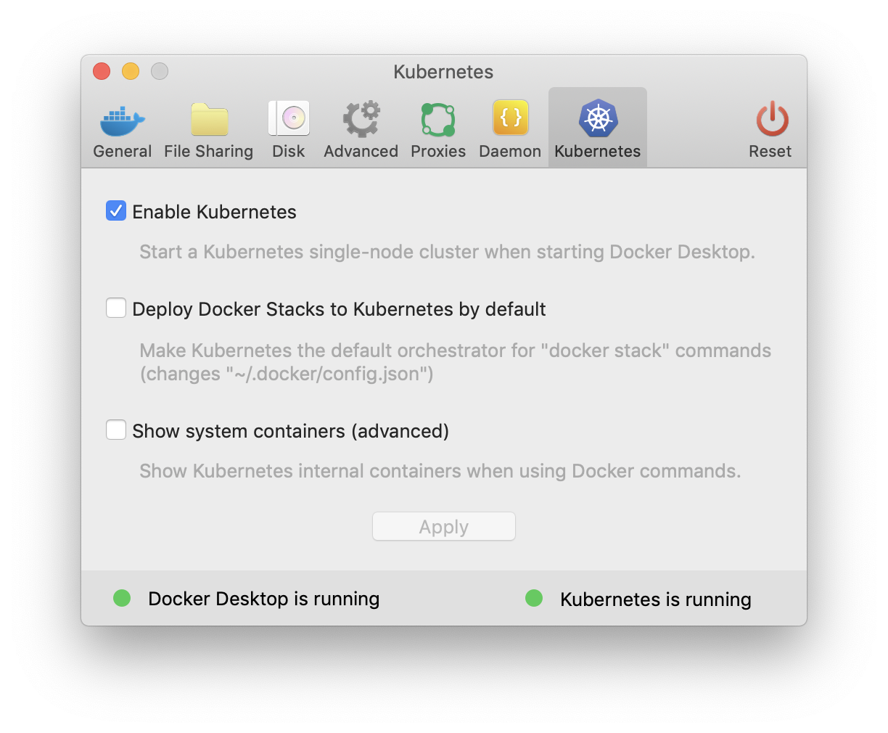
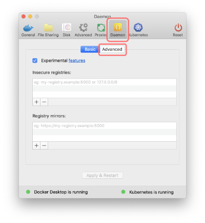
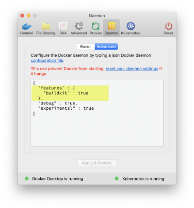

# Environment setup

To complete these exercises you will need several tools:

* Docker Engine, Compose, and Swarm
* Kubernetes

There are several options for installing or accessing all of these:

## Method 1: Docker Desktop for Windows and macOS

If you're on a Windows 10 or macOS machine it's simple to get all of the above components by using Docker Desktop. There's a free Community version of Docker Desktop for both operating systems you can [download from Docker](https://hub.docker.com/?overlay=onboarding).

Once you've installed Docker Desktop, you can easily enable Kubernetes. With Docker Desktop running, click the Moby icon and select `Preferences...`. Then look for the `Kubernetes` tab and click the `Enable Kubernetes` checkbox. Follow the prompts and in 2-5 minutes you should be all set.



You can test that everything is successful by running the following:

```bash
# check your Docker Engine details
$ docker version
Client: Docker Engine - Enterprise
 Version:           19.03.2
 API version:       1.40
 Go version:        go1.12.8
 Git commit:        c92ab06
 Built:             Thu Aug 29 13:10:09 2019
 OS/Arch:           darwin/amd64
 Experimental:      true

Server: Docker Engine - Enterprise
 Engine:
  Version:          19.03.2
  API version:      1.40 (minimum version 1.12)
  Go version:       go1.12.8
  Git commit:       c92ab06
  Built:            Thu Aug 29 13:15:55 2019
  OS/Arch:          linux/amd64
  Experimental:     true
 containerd:
  Version:          v1.2.6
  GitCommit:        894b81a4b802e4eb2a91d1ce216b8817763c29fb
 runc:
  Version:          1.0.0-rc8
  GitCommit:        425e105d5a03fabd737a126ad93d62a9eeede87f
 docker-init:
  Version:          0.18.0
  GitCommit:        fec3683

# Check that kubernetes is installed and working properly
$ kubectl version
Client Version: version.Info{Major:"1", Minor:"14", GitVersion:"v1.14.6", GitCommit:"96fac5cd13a5dc064f7d9f4f23030a6aeface6cc", GitTreeState:"clean", BuildDate:"2019-08-19T11:13:49Z", GoVersion:"go1.12.9", Compiler:"gc", Platform:"darwin/amd64"}
Server Version: version.Info{Major:"1", Minor:"14", GitVersion:"v1.14.6", GitCommit:"96fac5cd13a5dc064f7d9f4f23030a6aeface6cc", GitTreeState:"clean", BuildDate:"2019-08-19T11:05:16Z", GoVersion:"go1.12.9", Compiler:"gc", Platform:"linux/amd64"}

$ kubectl get cs
NAME                 STATUS    MESSAGE             ERROR
scheduler            Healthy   ok                  
controller-manager   Healthy   ok                  
etcd-0               Healthy   {"health":"true"}   
```

---

## Method 2: Docker Engine for Linux

On Linux operating systems you can install [Docker Engine - Community](https://hub.docker.com/search?q=&type=edition&offering=community) which, includes Compose and Swarm.

### Kubernetes

If you want to complete the final section in this lab you will also need to install Kubernetes. If you don't want to mess with that on your own machine you can access an online Docker + Kubernetes environment at https://labs.play-with-k8s.com/. Or, if you want you could install Kubernetes locally using something like [minikube](https://kubernetes.io/docs/tasks/tools/install-minikube/).

---

## Method 3: Play With Docker & Play With Kubernetes

If you don't want to - or can't - install software on your own machine you can also access an online environment that provides access to Docker Engines and Kubernetes through your browser:

* https://labs.play-with-docker.com has Docker Engine nodes
* https://labs.play-with-k8s.com has Docker Engine hosts with Kubernetes already installed

---

## Recommended for all methods: Use BuildKit

It's not required in the labs, but [BuildKit](https://docs.docker.com/develop/develop-images/build_enhancements/) is the new, enhanced, and much faster way to build container images.

To enable BuildKit:

* Set an environment variable:
  * `DOCKER_BUILDKIT=1` on macOS or Linux
  * `setx DOCKER_BUILDKIT 1` on Windows 10

You can also use the Preferences panel in Docker Desktop to turn on BuildKit:

1. Click the "Daemon" tab and then the "Advanced" button (you do not need to enable Experimental features)



2. Add the following lines then apply and Docker Desktop will prompt you to restart to activate the new features:


