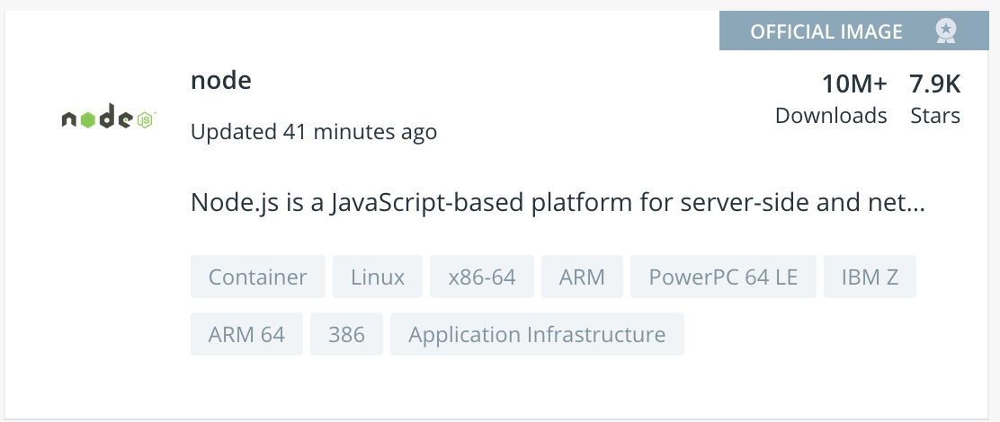

# Create the application's image

* We will use 2 images to package the application
  1. one image for the Node.js application
  2. one image for the MongoDB database

## The Application

* There are several possibilities to create the image
  1. Extend an official Linux distribution image (Ubuntu, CentOS, ...) and install Node.js runtime
  2. Search Docker Hub for any of the community created Node.js images, though you may want to take care to ensure you get images only from sources you trust, which leads us to another options...
  3. Use Docker's official [Node.js image](https://hub.docker.com/_/node)

We'll go for the third option as it offers an optimized image, built following Docker's best practices, with new versions created regularly as Node.js releases updates.

Look for the _Official Image, Verified Publisher,_ or _Docker Certified_ badges when you search Hub to know you're getting safe content.


## Database

* Usage of the official [MongoDB image](https://hub.docker.com/_/mongo)

## Dockerfile

We'll use the following Dockerfile to build our application's image:

```
# Use node 10.16.3 on Alpine Linux
FROM node:10.16.3-alpine
ENV LAST_UPDATED 20190920T165400

# Copy source code
COPY . /app

# Change working directory
WORKDIR /app

# Install dependencies
RUN npm install

# Expose API port to the outside
EXPOSE 80

# Launch application
CMD ["npm","start"]
````

Basically, the Dockerfile performs the following actions:

* Start FROM the official node:10.16.3 image on Alpine Linux
  * _Alpine_ is a minimal Linux distribution so the base layer is only around 5 MB. With the Node.js and npm packages the full image is only ~24MB. Other images are available as well.
* COPY application sources in to the WORKDIR
* RUN npm to install dependencies
* EXPOSE port to the outside from the Docker host
* define default command (CMD) to run when instantiating the image

## Image creation

* Create the image `docker build -t message-app .`

* List all images available on the Docker host `docker images message-app`

## Let's instantiate a container

```
$ docker run message-app
npm info it worked if it ends with ok
...
error: A hook (`orm`) failed to load!
error: Error: Failed to connect to MongoDB.  Are you sure your configured Mongo instance is running?
 Error details:
{ [MongoError: connect ECONNREFUSED 127.0.0.1:27017]
  name: 'MongoError',
  message: 'connect ECONNREFUSED 127.0.0.1:27017' }]
  originalError:
   { [MongoError: connect ECONNREFUSED 127.0.0.1:27017]
     name: 'MongoError',
     message: 'connect ECONNREFUSED 127.0.0.1:27017' } }
```

**The application cannot connect to a database as we did not provide external db information nor did we start a container running MongoDB**. We'll do that in [the next step](3_publish_image.md).
