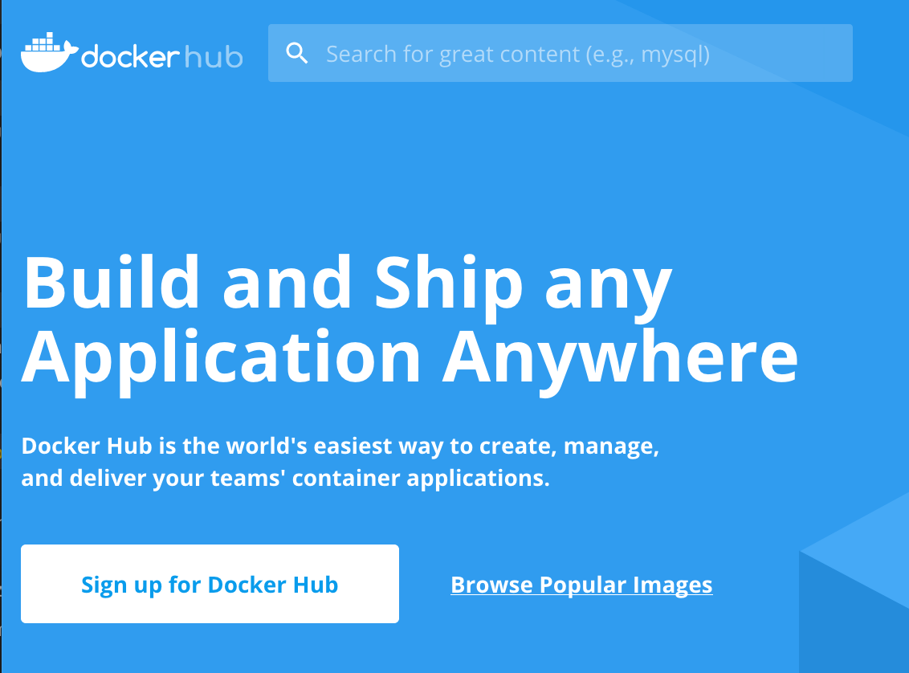
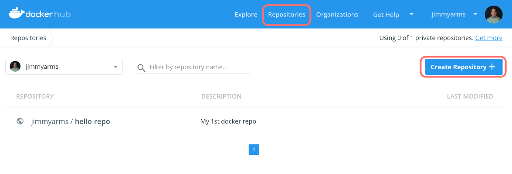
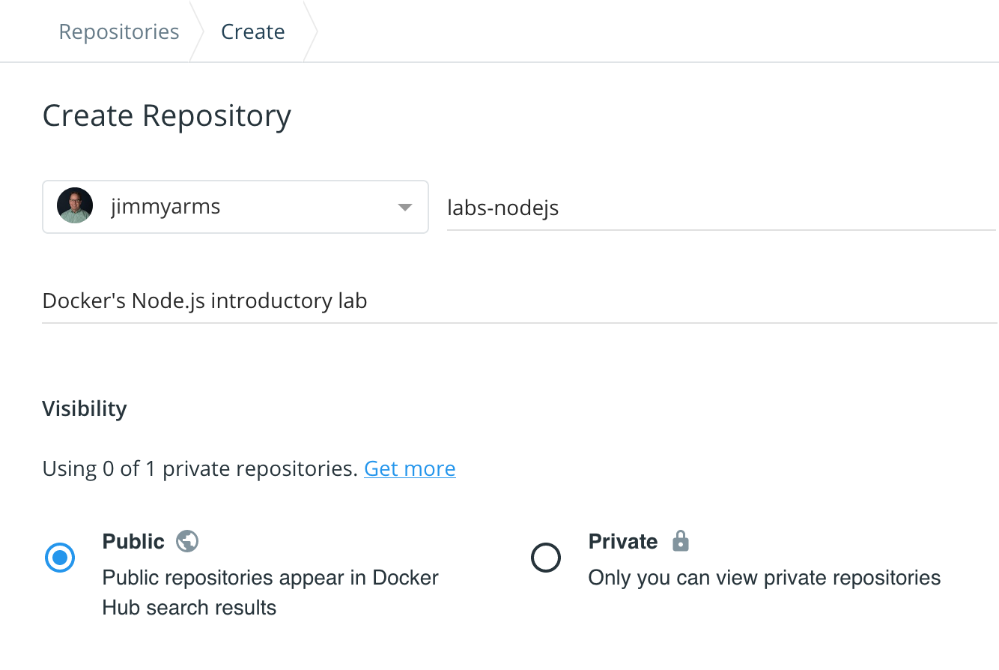
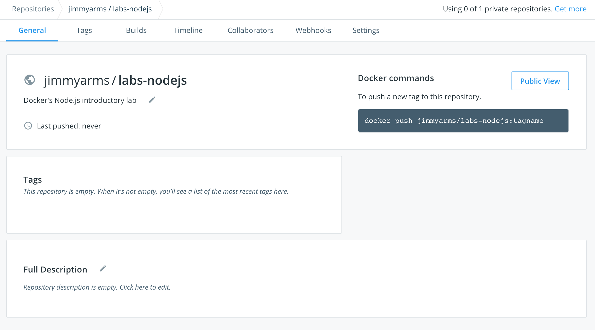
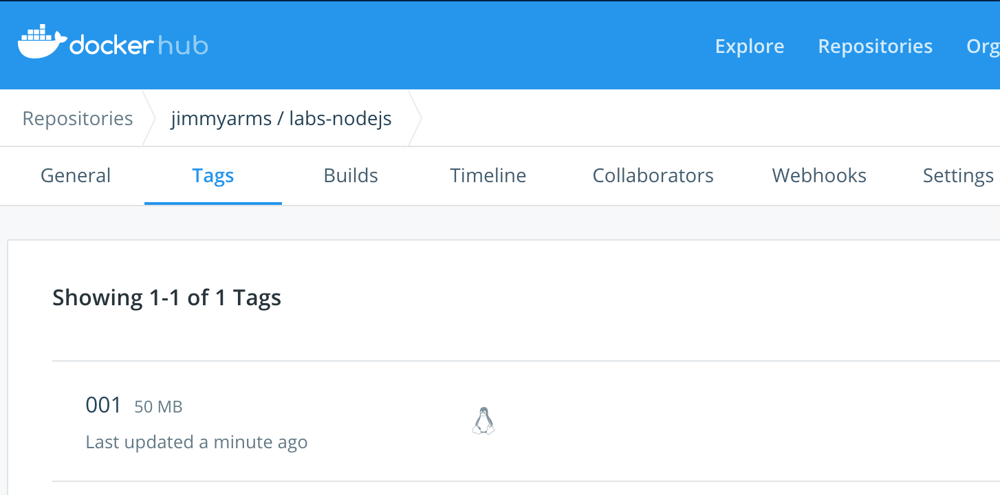

# Publish your image

The following procedure describes how to create a repository on Docker Hub and publish an image.

## 1. Make sure you have an account on Docker Hub

[Docker Hub](https://hub.docker.com) is the largest and most popular public container image repository. The Node.js and MongoDB base images we're using in this exercise are stored there, along with millions of other images.

You can sign up for free and publish your own images as well, and either make them available publicly or keep them private and just share with whom you choose.

If you already have a Docker Hub account, you can skip to step 2, otherwise:
* Go to https://hub.docker.com
* Click the _Sign up for Docker Hub_ button and complete the sign-up process.


## 2. Create a repository on Docker's Public Registry

* Login to Docker Hub using your account, if you haven't already
* View the list of your repositories by clicking the "Repositories" link, then click the "Create Repository +" button


* You can give your repo a name you think is descriptive. We'll be using `labs-nodejs` throughout the exercises so if you use a different name just remember to swap in the name you created. You can add a description if you want, and check out the other repository options. When you're set, click the "Create" button at the bottom of the page.


* Your new repository is now created and ready for use! Notice that the right hand side of the screen gives you the Docker command to push a container image to your repository: `docker push <org>/<repository>:<tag>`. This is the same basic format for every registry - public or private - back on the open source Docker Registry v2 project. As such, it's a format you'll use quite often and you'll need it for other commands like `docker tag`, `docker build -t`, and `docker pull`.
  * Note: if you're pushing or pulling an image from a Registry other than Docker Hub then you'll also have to add the server name or IP so the full format of the command is:
  * `docker push <registry_host:port>/<org>/<repository>:<tag>`



## 3. Prepare the Node.js application image

* In the previous step we used `docker build -t message-app .` to create a container image. If you recall, when you ran the `docker image ls` command you saw something like this:

```bash
REPOSITORY          TAG                 IMAGE ID            CREATED             SIZE
message-app         latest              1783ed74716a        47 hours ago        164MB
```

Now that you've created a repository on Docker Hub, you see some familiar terminology here: you have a local _repository_ named `message-app` that has one image in it, tagged with `latest`.

We want to push that image to Docker Hub so we need to tag it differently:

```bash
$ docker tag message-app:latest <your_hub_ID>/labs-nodejs:001

# now view your new image tag. I'm using my *jimmyarms* account on Hub 
# so this is how it looks for me
$ docker image ls <your_hub_id>/labs-nodejs

REPOSITORY              TAG                 IMAGE ID            CREATED             SIZE
jimmyarms/labs-nodejs   001                 1783ed74716a        47 hours ago        164MB
```

## 4. Push your image to Docker Hub

Before publishing an image, authentication must be performed with the following command with your Docker Hub credentials:
```docker login```

You can then push your image to your repository, substituting your own account in place of "jimmyarms":

```
$ docker push jimmyarms/labs-nodejs:001
```
If you visit the repository in your browser your new image should now be listed:


## 5. Instantiate the image

The image can then be used from any Docker host (the image is public in this example)

```bash
$ docker pull jimmyarms/labs-nodejs:001
$ docker run -dP jimmyarms/labs-nodejs:001
85dcf6ae52a17c1d85cfd016a24f4a655717b349a6382818d6c2f27a1027f081
```

This time the `docker run` command will give you a different output because you used the `-d` option, which instructs Docker Engine to run in the image in _detached_ mode. You are given the _container ID_ as the output this time (that long hex string).

We already know our app won't run because we haven't fixed our missing database, yet. You can verify this by viewing the container logs, though.

```bash
$ docker container logs 85dc

> message-app@0.0.0 start /app
> NODE_ENV=development node app.js

 info: ·• Auto-migrating...  (alter)
 info:    Hold tight, this could take a moment.
error: A hook (`orm`) failed to load!
error: Could not tear down the ORM hook.  Error details: Error: Consistency violation: Attempting to tear down a datastore (`default`) which is not currently registered with this adapter.  This is usually due to a race condition in userland code (e.g. attempting to tear down the same ORM instance more than once), or it could be due to a bug in this adapter.  (If you get stumped, reach out at http://sailsjs.com/support.)
```

Here we used the container ID to look at the logs and we see the same error messages we saw earlier. We just used a few characters of the ID...as long as you enter enough to identify a specific container the Docker Engine can sort out the rest for you.
